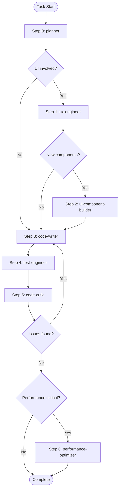

# CLAUDE.md

This file provides guidance to Claude Code (claude.ai/code) when working with code in this repository.

## Core AI Instructions

- **Memory Efficiency**: Use specialized sub-agents for complex tasks
- **Tool Optimization**: Evaluate results before proceeding to next steps
- **Parallel Processing**: Run independent tasks concurrently
- **Verification**: Always verify critical operations

## Sub-Agent System

This project uses specialized sub-agents defined in `.claude/agents/`. Use the Task tool to invoke them.

### Available Agents

| Agent | Description | When to Use |
|-------|-------------|-------------|
| `planner` | Requirements analysis, task decomposition, priority decisions | New feature development, refactoring start |
| `ux-engineer` | Screen design, component structure definition | UI design work |
| `ui-component-builder` | Reusable Compose component implementation | UI component creation |
| `code-writer` | Feature implementation (Domain, Data, Presentation) | Business logic and feature code |
| `test-engineer` | Unit/UI/Integration test writing | Test code creation and execution |
| `code-critic` | Code review, improvement proposals, debates | Code quality review |
| `performance-optimizer` | Recomposition optimization, memory leak detection | Performance optimization |

### Mandatory Workflow (Agent-driven)



#### Step 0) Planning (ALWAYS)
- **Invoke**: `planner`
- **Gate**:
  - Requirements clarified (ask questions if ambiguous)
  - Task breakdown by layer (Domain/Data/Presentation)
  - Acceptance criteria defined
- **Next**: `ux-engineer` (if UI involved) else `code-writer`

#### Step 1) UX Spec (CONDITIONAL)
- **Skip if**: No UI changes (backend-only, refactoring, bug fix without UI)
- **Invoke**: `ux-engineer`
- **Gate**:
  - Screen spec + interaction table
  - Composable hierarchy
  - MVI contract draft (UiState/Event/Effect)
- **Next**: `ui-component-builder` (if new components) else `code-writer`

#### Step 2) UI Components (CONDITIONAL)
- **Skip if**: No new reusable components needed (using existing components only)
- **Invoke**: `ui-component-builder`
- **Gate**:
  - Reusable components implemented
  - Previews for light/dark + multiple sizes + fontScale
  - State hoisting + modifier exposed
- **Next**: `code-writer`

#### Step 3) Implementation (ALWAYS)
- **Invoke**: `code-writer`
- **Gate**:
  - Clean Architecture boundaries respected
  - MVI ViewModel/Contract wired
  - Required MCP/codex-cli rounds completed
- **Next**: `test-engineer`

#### Step 4) Tests (ALWAYS)
- **Invoke**: `test-engineer`
- **Gate**:
  - Unit tests for business logic
  - ViewModel state/effect tests
  - UI tests where interaction exists
- **Next**: `code-critic`

#### Step 5) Review (ALWAYS)
- **Invoke**: `code-critic`
- **Gate**:
  - No 🔴/🟠 issues remain
  - If issues found → return to `code-writer`

#### Step 6) Performance (CONDITIONAL but recommended)
- **Invoke**: `performance-optimizer` when:
  - Lazy lists, heavy recomposition risk, animations, big data, or release checklist
- **Gate**:
  - Stable params, keys, remember/derivedStateOf verified
  - Optimization validated via codex-cli rounds

## MCP Servers

Available MCP servers for enhanced capabilities:

| Server | Purpose | Usage |
|--------|---------|-------|
| `context7` | Latest library documentation lookup | `resolve-library-id` → `get-library-docs` |
| `sequential-thinking` | Step-by-step analysis for complex problems | Design, debugging, architecture decisions |
| `exa` | Web search, code context search | When external information needed |
| `github` | GitHub issues, PR management | Collaboration tasks |
| `codex-cli` | Code analysis, review support | Code quality review |

## Common Rules

- **Language**: Kotlin
- **UI**: Jetpack Compose with Material3
- **Architecture**: Clean Architecture + MVI
- **DI**: Hilt
- **Async**: Coroutines + Flow

## Build Commands

```bash
# Build the project
./gradlew build

# Build specific module
./gradlew :feature:home:build

# Run all tests
./gradlew test

# Run tests for a specific module
./gradlew :feature:home:testDebugUnitTest

# Clean build
./gradlew clean build
```

## Architecture

This is an Android Kotlin project for a Korean Lotto (로또) assistance app. It follows Clean Architecture with multi-module structure.

### Module Structure

```
app/                    # Application entry point, depends on all feature/core modules
build-logic/            # Convention plugins for consistent build configuration
├── convention/         # Custom Gradle plugins: lotto.android.application, lotto.android.library,
│                       # lotto.android.hilt, lotto.jvm.library
core/
├── domain/            # Pure Kotlin module (no Android deps) - business logic, models, use cases, repository interfaces
├── data/              # Repository implementations, data sources, mappers
├── network/           # Retrofit API, network models
├── database/          # Room database, DAOs, entities, migrations
├── di/                # Hilt DI modules
├── util/              # Utilities (e.g., LottoDate for draw number calculations)
feature/
├── home/              # Main screen with Compose UI, MVI pattern (UiState/Event/Effect)
├── qrscan/            # QR code scanning with CameraX + ML Kit
```

### Key Patterns

**MVI Architecture (feature modules):**
- `*Contract.kt` defines `UiState`, `Event`, and `Effect` sealed classes
- `*ViewModel.kt` uses `StateFlow` for state, `Channel` for one-time effects
- Example: `LottoResultViewModel` handles events via `onEvent()` function

**Repository Pattern:**
- Interfaces in `core/domain/repository/`
- Implementations in `core/data/repository/`
- Data sources abstract local (Room) vs remote (Retrofit) access

**Dependency Injection:**
- Hilt throughout, using `@HiltViewModel` for ViewModels
- DI modules in `core/di/`, `core/network/di/`, `core/database/di/`, `core/data/di/`

### Domain Models

- `LottoResult`: Draw result with numbers, bonus, prize info
- `LottoTicket`: User's ticket with multiple games, QR URL, check status
- `LottoGame`: Single game with 6 numbers, type (AUTO/MANUAL), winning rank

### Tech Stack

- Kotlin 2.0, Compose with Material3
- Hilt for DI, Room for local DB, Retrofit/OkHttp for network
- CameraX + ML Kit for QR scanning
- Testing: JUnit, MockK, Turbine for Flow testing, Coroutines Test

### QR Code Format

Lotto QR codes use format: `?v=<4-digit-round><games>` where each game is `[m|q]<12-digit-numbers>` (m=manual, q=auto). Parser: `LottoQrParser.kt`