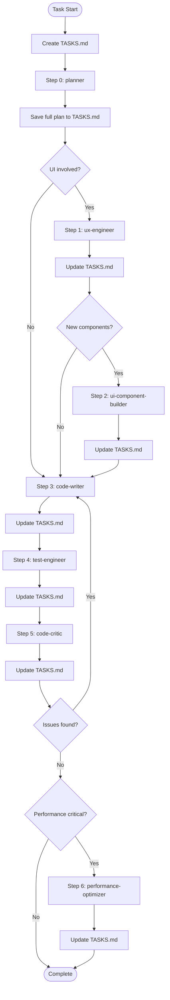

# CLAUDE.md

This file provides guidance to Claude Code (claude.ai/code) when working with code in this repository.

## Core AI Instructions

- **Memory Efficiency**: Use specialized sub-agents for complex tasks
- **Tool Optimization**: Evaluate results before proceeding to next steps
- **Parallel Processing**: Run independent tasks concurrently
- **Verification**: Always verify critical operations
- **Context Management**: Use TASKS.md for long-horizon tasks (auto-compact handles context limits)

## TASKS.md - Context Persistence System

TASKS.md is a "working scratchpad" file that maintains task state across context compaction (compact).

### Core Principles

1. **New Task Start**: Create a fresh TASKS.md when starting a completely new task
2. **After Step Completion**: Update TASKS.md after each agent step (auto-compact will trigger when needed)
3. **Post-Compact Recovery**: Read TASKS.md after compact to restore context

### TASKS.md Structure

```markdown
# Current Task: [Task Title]

## Overview
- **Request**: [Original request summary]
- **Started**: [Start time]
- **Current Step**: [Current step number and name]

## Progress

### ✅ Completed Steps
- [x] Step 0: planner - [Completion summary]
- [x] Step 1: ux-engineer - [Completion summary]

### 🔄 Current Step
- [ ] Step 2: ui-component-builder
  - Status: in_progress
  - Working on: [Current work description]
  - Blockers: [Record if any]

### ⏳ Pending Steps
- [ ] Step 3: code-writer
- [ ] Step 4: test-engineer
- [ ] Step 5: code-critic

## Plan (Full - DO NOT summarize)
[Complete plan from planner agent - this is the source of truth]

## Key Artifacts
- **UX Spec**: [UX-engineer result summary]
- **Components**: [List of created components]
- **Files Modified**: [List of modified files]

## Context for Next Step
[Critical information needed for the next step]

## Notes
[Issues discovered, decisions made, TODOs, etc.]
```

### Usage Rules

| Situation | Action |
|-----------|--------|
| Starting a completely new task | Create new TASKS.md (overwrite existing) |
| Starting an agent step | Read TASKS.md to understand context |
| Completing an agent step | Update TASKS.md (auto-compact triggers when context is full) |
| Resuming after compact | Read TASKS.md to check progress |
| Task fully complete | Mark complete in TASKS.md, create fresh on next task |

## Sub-Agent System

This project uses specialized sub-agents defined in `.claude/agents/`. Use the Task tool to invoke them.

### Available Agents

| Agent | Description | When to Use |
|-------|-------------|-------------|
| `planner` | Requirements analysis, task decomposition, priority decisions | New feature development, refactoring start |
| `ux-engineer` | Screen design, component structure definition | UI design work |
| `ui-component-builder` | Reusable Compose component implementation | UI component creation |
| `code-writer` | Feature implementation (Domain, Data, Presentation) | Business logic and feature code |
| `test-engineer` | Unit/UI/Integration test writing | Test code creation and execution |
| `code-critic` | Code review, improvement proposals, debates | Code quality review |
| `performance-optimizer` | Recomposition optimization, memory leak detection | Performance optimization |

### Mandatory Workflow (Agent-driven)



### Compact Strategy

Auto-compact triggers automatically when context window is full. Manual `/compact` is optional.

| Phase | Steps | TASKS.md Action |
|-------|-------|-----------------|
| **Phase 1: Planning** | planner | Save full plan to TASKS.md |
| **Phase 2: UI Design** | ux-engineer → ui-component-builder | Update TASKS.md with specs |
| **Phase 3: Implementation** | code-writer | Update TASKS.md with file list |
| **Phase 4: Quality** | test-engineer → code-critic | Update TASKS.md with results |
| **Phase 5: Optimization** | performance-optimizer | Mark task complete |

> **Note**: User can run `/compact` manually anytime if they want to free up context.

### Workflow Step Protocol

Each agent step follows this protocol:

```
1. [Step Start] Read TASKS.md → Restore context
2. [Execute] Run the agent
3. [Step Complete] Update TASKS.md (completion info, created files, next step context)
4. [Continue] Proceed to next step (auto-compact handles context limits)
```

#### Step 0) Planning (ALWAYS) - Phase 1
- **Before**: Create new TASKS.md if new task, read existing if continuing
- **Invoke**: `planner`
- **Gate**:
  - Requirements clarified (ask questions if ambiguous)
  - Task breakdown by layer (Domain/Data/Presentation)
  - Acceptance criteria defined
- **After**: Save **full plan** to TASKS.md (DO NOT summarize - plan is the source of truth)
- **Next**: `ux-engineer` (if UI involved) else `code-writer`

#### Step 1) UX Spec (CONDITIONAL) - Phase 2 Start
- **Skip if**: No UI changes (backend-only, refactoring, bug fix without UI)
- **Before**: Read TASKS.md to restore planning context
- **Invoke**: `ux-engineer`
- **Gate**:
  - Screen spec + interaction table
  - Composable hierarchy
  - MVI contract draft (UiState/Event/Effect)
- **After**: Update TASKS.md (UX spec, component list)
- **Next**: `ui-component-builder` (if new components) else `code-writer`

#### Step 2) UI Components (CONDITIONAL) - Phase 2 End
- **Skip if**: No new reusable components needed (using existing components only)
- **Before**: Read TASKS.md to restore UX spec context
- **Invoke**: `ui-component-builder`
- **Gate**:
  - Reusable components implemented
  - Previews for light/dark + multiple sizes + fontScale
  - State hoisting + modifier exposed
- **After**: Update TASKS.md (list of created component files)
- **Next**: `code-writer`

#### Step 3) Implementation (ALWAYS) - Phase 3
- **Before**: Read TASKS.md to understand previous step artifacts
- **Invoke**: `code-writer`
- **Gate**:
  - Clean Architecture boundaries respected
  - MVI ViewModel/Contract wired
  - Required MCP/codex-cli rounds completed
- **After**: Update TASKS.md (implemented files, key changes)
- **Next**: `test-engineer`

#### Step 4) Tests (ALWAYS) - Phase 4 Start
- **Before**: Read TASKS.md to understand implemented code
- **Invoke**: `test-engineer`
- **Gate**:
  - Unit tests for business logic
  - ViewModel state/effect tests
  - UI tests where interaction exists
- **After**: Update TASKS.md (test files, coverage)
- **Next**: `code-critic`

#### Step 5) Review (ALWAYS) - Phase 4 End
- **Before**: Read TASKS.md to identify files for review
- **Invoke**: `code-critic`
- **Gate**:
  - No 🔴/🟠 issues remain
  - If issues found → return to `code-writer`
- **After**: Update TASKS.md (review results, issue list)

#### Step 6) Performance (CONDITIONAL) - Phase 5
- **Before**: Read TASKS.md to identify optimization targets
- **Invoke**: `performance-optimizer` when:
  - Lazy lists, heavy recomposition risk, animations, big data, or release checklist
- **Gate**:
  - Stable params, keys, remember/derivedStateOf verified
  - Optimization validated via codex-cli rounds
- **After**: Update TASKS.md (optimization results) → Mark task complete

## MCP Servers

Available MCP servers for enhanced capabilities:

| Server | Purpose | Usage |
|--------|---------|-------|
| `context7` | Latest library documentation lookup | `resolve-library-id` → `get-library-docs` |
| `sequential-thinking` | Step-by-step analysis for complex problems | Design, debugging, architecture decisions |
| `exa` | Web search, code context search | When external information needed |
| `github` | GitHub issues, PR management | Collaboration tasks |
| `codex-cli` | Code analysis, review support | Code quality review |

## Common Rules

- **Language**: Kotlin
- **UI**: Jetpack Compose with Material3
- **Architecture**: Clean Architecture + MVI
- **DI**: Hilt
- **Async**: Coroutines + Flow

## Build Commands

```bash
# Build the project
./gradlew build

# Build specific module
./gradlew :feature:home:build

# Run all tests
./gradlew test

# Run tests for a specific module
./gradlew :feature:home:testDebugUnitTest

# Clean build
./gradlew clean build
```

## Architecture

This is an Android Kotlin project for a Korean Lotto (로또) assistance app. It follows Clean Architecture with multi-module structure.

### Module Structure

```
app/                    # Application entry point, depends on all feature/core modules
build-logic/            # Convention plugins for consistent build configuration
├── convention/         # Custom Gradle plugins: lotto.android.application, lotto.android.library,
│                       # lotto.android.hilt, lotto.jvm.library
core/
├── domain/            # Pure Kotlin module (no Android deps) - business logic, models, use cases, repository interfaces
├── data/              # Repository implementations, data sources, mappers
├── network/           # Retrofit API, network models
├── database/          # Room database, DAOs, entities, migrations
├── di/                # Hilt DI modules
├── util/              # Utilities (e.g., LottoDate for draw number calculations)
feature/
├── home/              # Main screen with Compose UI, MVI pattern (UiState/Event/Effect)
├── qrscan/            # QR code scanning with CameraX + ML Kit
```

### Key Patterns

**MVI Architecture (feature modules):**
- `*Contract.kt` defines `UiState`, `Event`, and `Effect` sealed classes
- `*ViewModel.kt` uses `StateFlow` for state, `Channel` for one-time effects
- Example: `LottoResultViewModel` handles events via `onEvent()` function

**Repository Pattern:**
- Interfaces in `core/domain/repository/`
- Implementations in `core/data/repository/`
- Data sources abstract local (Room) vs remote (Retrofit) access

**Dependency Injection:**
- Hilt throughout, using `@HiltViewModel` for ViewModels
- DI modules in `core/di/`, `core/network/di/`, `core/database/di/`, `core/data/di/`

### Domain Models

- `LottoResult`: Draw result with numbers, bonus, prize info
- `LottoTicket`: User's ticket with multiple games, QR URL, check status
- `LottoGame`: Single game with 6 numbers, type (AUTO/MANUAL), winning rank

### Tech Stack

- Kotlin 2.0, Compose with Material3
- Hilt for DI, Room for local DB, Retrofit/OkHttp for network
- CameraX + ML Kit for QR scanning
- Testing: JUnit, MockK, Turbine for Flow testing, Coroutines Test

### QR Code Format

Lotto QR codes use format: `?v=<4-digit-round><games>` where each game is `[m|q]<12-digit-numbers>` (m=manual, q=auto). Parser: `LottoQrParser.kt`